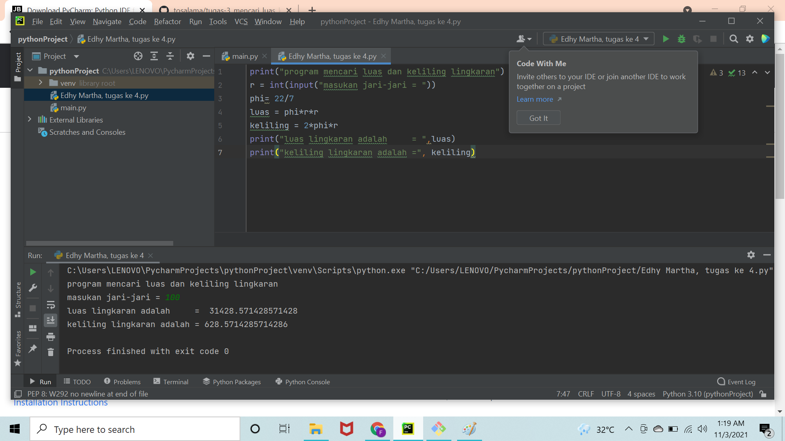
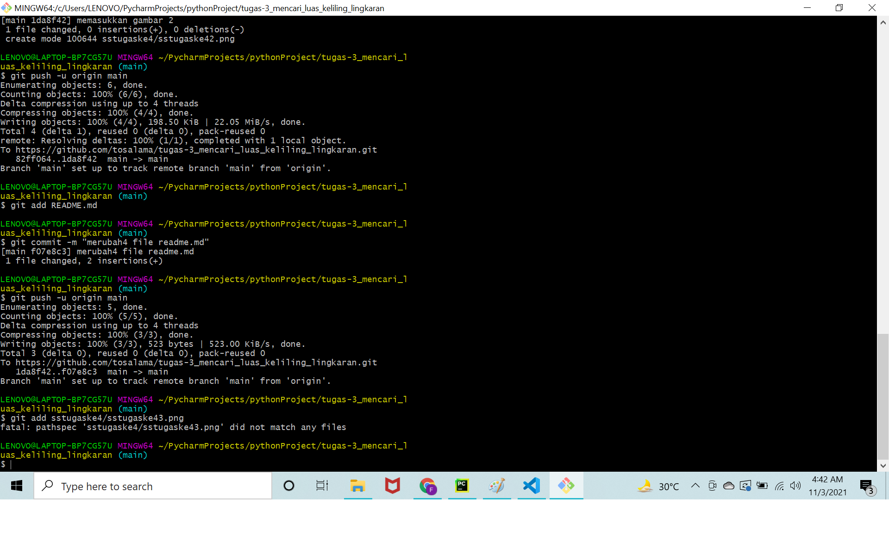

# nama edhy martha
## tugas-3_mencari_luas_keliling_lingkaran
pertama download aplikasi Pycharm

selanjutnya kita buat project baru di pycharm 

adapun kita buat file tersebut di pycharm dan kita mengumpulkan file ini dalam bentuk repository di github.com
